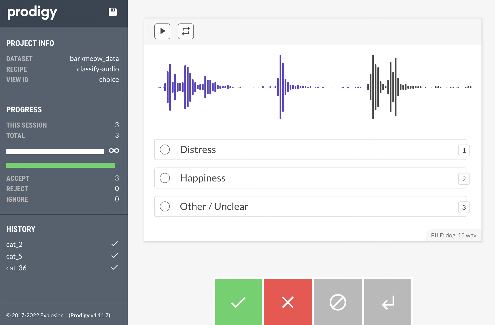

# Prodigy project labeling audio of dogs and cats

This project contains recipes for label classification dog and cat audio .wav files into different emotional states (Happiness, Distress, Other).



## Installation

The installation process is automated via `make`.

```bash
# Create virtual environment (optional, recommended)
make create-venv
# Install all dependencies
make install
# Download the BarkMeowDB files: https://zenodo.org/record/3563990
make download
```

In order for the install to work, you'll need to
add a `.env` file to the root of the project that
contains your Prodigy license key. It should look
something like:

```
PRODIGY_KEY="1234-ABCD-5678-EFGH"
```

## Contents 

The project has a few notable files/folders: 

- The `data` folder contains `.wav` files. This is empty by default but users can run the `make download` to download the files.

## Usage

You can run Prodigy via `make` too. 

```bash
# Run prodigy audio recipe for labeling
make prodigy-label
```

## Cleaning

You can clean the installed data/cache with the following commands:

```bash
# clean cache files (e.g., jupyter)
make clean-cache
# remove all wav files
make clean-files
# remove venv (if run previously)
make clean-venv
# remove prodigy dataset of labeled files
make clean-prodigy
```
